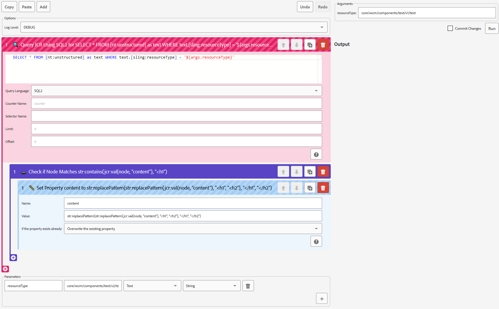

# JCR Hopper


_Migrate AEM with Grace_

JCR Hopper is a migration and reporting tool for <abbr title="Adobe Experience Manager">AEM</abbr>’s content repository.
It has its own script format that is valid JSON and consists of a series of actions,
each of which “hops” over nodes in the repository.

JCR Hopper also comes with a visual tool to create, preview and run the scripts.

## Installation

Download the package (.zip file) from the “Releases” section in GitHub and install it using package manager.

Alternatively, if you don’t want the script builder GUI, you can also only deploy the bundle (.jar file).

## Usage

### Java API

Running a script requires a script (either as a JSON-encoded string or as an instance of `com.swisscom.aem.tools.jcrhopper.config.Script`) and a runner (`com.swisscom.aem.tools.jcrhopper.Runner`).

#### Creating a script

JCR hopper scripts comprise the following:

- A log level that determines which log messages are sent to the run handler.
- A list of hop configs that are run against a given node. Hops can also have their own descendant pipelines of hop configs.
- A list of parameters that the script supports. Parameters always have a default value, thus passing arguments to the script runner is always optional. Each parameter also has a name, a script builder input type hint and an evaluation type that determines how the default values／arguments are to be interpreted.

#### Creating a sample script

JCR hopper sample scripts comprise the following:

- A `label` that is displayed in the dropdown for Scripts.
- A `log level` that determines which log messages are sent to the run handler.
- A `list of hop configs` that are run against a given node. Hops can also have their own descendant pipelines of hop configs.
- A `list of parameters` that the script supports. Parameters always have a default value, thus passing arguments to the script runner is always optional. Each parameter also has a name, a script builder input type hint and an evaluation type that determines how the default values／arguments are to be interpreted.

##### Inside JCR Hopper repo

Common reusable scripts could be added to JCR Hopper repo directly.

- Create a new json file with `log level` , `list of hop configs` & `list of parameters` under `/apps/jcr-hopper/script-builder/scripts/samples/` folder.
- Add an tag Entry in `/apps/jcr-hopper/script-builder/scripts/.content.xml` file for your new json and by defining user-friendly label for Sample script as `jcr:title`. Check this file on how it is added for previous sample script jsons.

##### Inside application project repo

If the Sample script is quite specific to your project needs then you can keep the script in your project repo with specific folder structure as defined below.

- Create a new json file `your-samnple-script.json` under `/apps/jcr-hopper/script-builder/scripts/{your-project-folder}` or any sub folder under it. json should contain `log level` , `list of hop configs` & `list of parameters`. Check the existing sample scripts for examples.
- Add an tag Entry in `/apps/jcr-hopper/script-builder/scripts/.content.xml` file for your new json and by defining user-friendly label for Sample script as `jcr:title`. Check this file on how it is added for previous sample script jsons.

High level structure of Script json content

```json
{
	"logLevel": "info",
	"hops": [],
	"parameters": []
}
```

#### Configuring a builder

Typically, a runner is created by means of a builder using `Runner#builder()`.

The builder offers various methods to configure the runner:

- `#addUtil(String, Object)`, `#addUtils(Map<String, Object>)`: Register namespaces for utility classes／objects that are available in JEXL expressions and script blocks.
- `#addVariable(String, Object)`, `#addVariables(Map<String, Object>)`: Make some variables known to the script ahead of time.
- `#addHop(Hop<?>)`, `#addHops(Collection<Hop<?>>)`: Make hop types known to the runner. Note: scripts in JSON format can only be parsed once the hop types they are using are registered.
- `#registerFile(String, Function<String, File>)`, `#registerFiles(Map<String, Function<String, File>>)`: Register file creators that allow scripts to aggregate information into output files.
- `#addDefaultUtils(boolean)`: if set to `true`, The script will know about the `arrays`, `stream`, `class`, and `collections` utility namespaces.
- `#runHandler(com.swisscom.aem.tools.jcrhopper.config.RunHandler)`: Set a listener that is informed about script output and events. The default run handler does nothing (but log messages are logged using Slf4j in any case).
- `#scriptEngineManager(javax.script.ScriptEngineManager)`: Set the script engine manager to use when searching for non-JEXL scripting engines.

Once the builder is configured, it can be turned into a runner with either `#build(Script)` or `#build(String)` (for JSON scripts).

#### Running a Script

A configured runner offers several overloads to run the script:

- `#run(javax.jcr.Node, boolean)`: Run the script on the given node. Save the session afterwards if the second argument is `true`.
- `#run(javax.jcr.Session, boolean)`: Same as above but use the root node of the given session.
- `#run(javax.jcr.Session, boolean, java.util.Map<String, String>)`, `#run(javax.jcr.Node, boolean, java.util.Map<String, String>)`: Same as above but with arguments to be passed to the script. Only arguments matching declared parameters on the script will be taken into account.

#### Using the OSGi Service

The OSGi service `com.swisscom.aem.tools.jcrhopper.osgi.RunnerService` is used to return pre-configured runner builders that already know about the default hops, utils and files.

#### Extending the OSGi Service

To extend runner builders returned by the OSGi service, create a component that provides the `com.swisscom.aem.tools.jcrhopper.osgi.RunnerBuilderExtension` service. Implement `#configure` to configure runner builders that are created via `RunnerService`.

### HTTP API

#### Use the Script Builder



The script builder is a visual tool designed to help you build, prototype and execute your scripts. It is available at `/apps/jcr-hopper/script-builder.html`.

#### Run the Script Manually

The `com.swisscom.aem.tools.impl.http.HopRunnerServlet` servlet listens at `/bin/servlets/jcr-hopper/run` (though that is configurable) for POST requests. Each request will trigger one script execution. The script, the commit flag and all script arguments are passed in the request.

The script will be executed with the JCR session that is associated with the privileges of the requesting HTTP user.

The servlet uses `RunnerService`, so any registered `RunnerBuilderExtension`s are available.

The response will be a new-line delimited list of JSON objects or strings.

To use cURL to execute a script, do the following:

```sh
# $DO_COMMIT is either "true" or "false"
# $AEM_INSTANCE is the base URL of your AEM instance
curl -X POST -F "_script=@/path/to/script.json" -F "_commit=$DO_COMMIT" "$AEM_INSTANCE/bin/servlets/jcr-hopper/run"
```

Additional arguments can also be passed with `-F`.

<small>Note: Usually, POST requests are subject to the CSRF filter, thus a `:cq_csrf_token` would need to be added. However, the default configuration allowlists the cURL user agent to not require that.</small>

## Expression Syntax

All configurable fields are either JEXL expressions (when the result type is arbitrary) or JEXL string templates (when the result is `String`).

Consult the [JEXL syntax reference](https://commons.apache.org/proper/commons-jexl/reference/syntax.html) for further details.

## Action Types

###  Get Child Nodes

Gets all child nodes of this node accessible through the current Session that match a given pattern. The pattern may be a full name, a partial name with one or more wildcard characters (\*), or a disjunction of those (using the | character).

For more information, see [Node#getNodes(String)](https://adobe.ly/2YrfG1G).

The nested hop pipeline will run on each matching child node.

###  Copy Node

Copy the current node recursively to a new destination.

The nested hop pipeline will run on the copied node.

###  Create Child Node

Create a new node. If the given path is relative, it is based on the current node’s path (usually used to create a child node).

The nested hop pipeline will run on the created node.

###  Declare Variables

Sets variables on the current scope, available in script runner hops and JEXL expressions of all subsequent hops and their nested pipelines.

This hop does not have a nested pipeline.

###  Iterate

Loops over an arbitrary expression. Can be configured to assume the expression evaluates to an iterable of nodes, in which case that becomes the current node of the nested pipeline. Otherwise, the nested pipeline stays on the current node but the iteration value becomes usable.

###  Filter

Runs the nested pipeline only if the given JEXL expression is matched.

###  Move Node

Moves the current node to a new location. Must not be used on the root node.

This hop does not have a nested pipeline.

###  Query JCR

Runs an XPath or SQL2 query against the JCR.

Runs the nested pipeline for each node found.

###  Rename Property

Changes the name of the given property on the current node.

This hop does not have a nested pipeline.

###  Reorder Node

Changes the order of the current node.

This hop does not have a nested pipeline.

###  Resolve Specific Node

Resolves a node at a specific location.

Runs the nested pipeline on the resolved node.

###  Run a Script

Runs a script with arbitrary code. Currently, JEXL is supported as well as all languages known to the `javax.script.ScriptEngineManager`.

This hop does not have a nested pipeline.

###  Set a Property

Sets a property on the current node.

This hop does not have a nested pipeline.

###  Catch Thrown Errors

Catches exceptions thrown on the nested pipeline and ensures hop execution of the current pipeline continues.

## Acknowledgements

[Mutant Standard emoji](https://mutant.tech/) are licensed CC BY-NC-SA 4.0 International.
